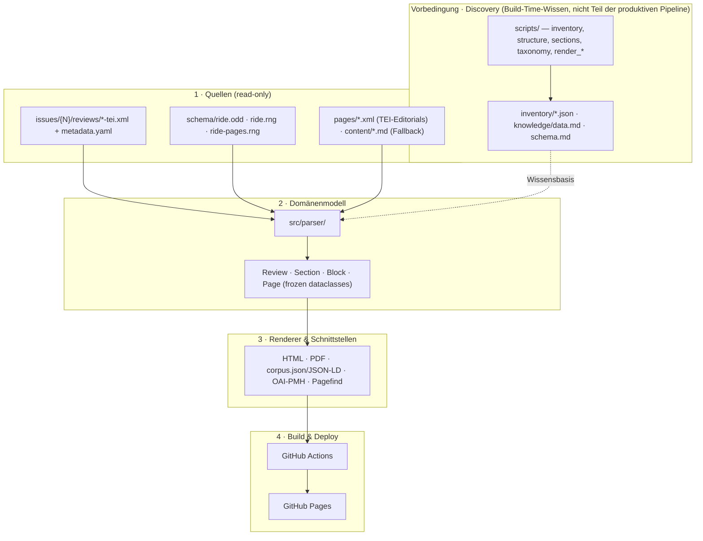

# Architecture

> Design intent for the static-site generator. Hand-written;
> revisit when reality diverges from these assumptions.
>
> Anchored to [[specification]] (product spec). Visual and interaction design is in [[interface]]. The phased build plan is in [[pipeline#Phasenplan]].

## Eigenbegriffe

Project-internal terms (*Promptotyping*, *Wissensdokument*, *Sonderfall-Branch*, *Element-Mapping*, *K-Ref*, *Apparate-Block*) are defined once, in the vault glossary at [[INDEX#Glossary]] — sibling documents link there instead of redefining them. The two most load-bearing for this document, *Sonderfall-Branch* and *Element-Mapping*, are introduced in context in the [Domain model](#domain-model) and [Element-Mapping](#element-mapping-declarative) sections below.

## Stakeholders and how they touch the system

The architecture is shaped by who uses it and where they enter. The
five stakeholder roles are stable across phases; the build plan in
[[pipeline#Phasenplan]] is sequenced so each role gets value as soon
as its inputs land.

| Role | What they do | Where they enter the system |
|---|---|---|
| **Editorial team (IDE)** | Curate review submissions, edit metadata, write editorial pages (about, imprint, criteria), set per-issue YAML. | `content/*.md`, `issues/{N}/metadata.yaml`, the TEI submission process upstream. |
| **Reviewers** | Author reviews in TEI per `ride.odd`. | `issues/{N}/reviews/*-tei.xml` (canonical source), the [[schema|RIDE schema]] as constraint. |
| **Readers** | Read reviews, follow citations, search across the corpus, cite reviews in their own work. | The deployed site — review pages, aggregation pages (tags, reviewers, resources), the search box, the `Cite` button per review. |
| **Indexers / harvesters** | Pull metadata into discovery layers (DOI, Google Scholar, ScholarLed, library catalogues). | `/api/corpus.json`, `/oai/`, `/sitemap.xml`, JSON-LD per review page, stable URLs per [[url-scheme|docs/url-scheme.md]]. |
| **Maintainers (this project)** | Add new TEI elements, change visual design, fix anomalies, ship new phases. | `src/parser/`, `src/render/`, `templates/`, `config/element-mapping.yaml`, `knowledge/` for design-intent decisions. |

Two axes of stakeholder load shape the architecture:

* **Reader-first.** Most stakeholder traffic is readers; the build is
  optimised for fast static pages, no runtime, no JS frameworks. The
  apparate-block design ([[interface#6]]) and per-paragraph copy-link
  ([[interface#11]]) are concessions to reader workflows that the
  domain model carries (`Paragraph.xml_id`, `Figure.xml_id`,
  `Reference.bucket`).
* **Editorial-light.** Editorial change should not require Python.
  `config/element-mapping.yaml` puts the dominant 90 % of presentation
  edits behind a YAML change — an editorial-team-friendly contact
  surface. New parsing semantics still need a maintainer.

## Inputs and outputs

**Inputs**
- `issues/{N}/reviews/*-tei.xml` — review files (canonical source, grouped per issue).
- `issues/{N}/metadata.yaml` — editorial issue metadata (DOI, editors, contribution order).
- `schema/ride.odd` + `schema/ride.rng` — RIDE schema customisation and compiled RelaxNG.
- `pages/<slug>.xml` — editorial pages in TEI, validated against `schema/ride-pages.rng` (read-only source for the `Page` model).
- `inventory/*.json` — corpus knowledge (regenerated from the above).
- `../ride/issues/issue{NN}/{slug}/pictures/` — per-issue picture assets, still in the sibling repo until they migrate too.

**Outputs**
- `site/` — HTML pages, CSS, fonts, JS, images.
- `site/issues/{N}/{review_id}/{review_id}.pdf` — per-review PDF, written by the WeasyPrint pass alongside the HTML when `--pdf` is set.
- `site/issues/{N}/{review_id}/{review_id}.xml` — original TEI, copied next to the rendered page so the sidebar download link resolves to a real file (R3).
- `site/issues/{N}/{review_id}/factsheet/index.html` — standalone Factsheet full page with the per-question questionnaire (R18).
- `site/pagefind/` — Pagefind-generated search bundle (UI script, search index, language workers); produced as a CI step after `python -m src.build`.
- `site/api/corpus.json` — full-corpus JSON dump with top-level `licence: {name, url}` (R15 / N6).
- `site/api/build-info.json` — aggregated build report (commit, date, validation, optional linkcheck, asset counts) with the same licence field (N4 / N7).
- `site/oai/` — OAI-PMH static snapshot (verb-per-file, A5).
- `site/sitemap.xml` — when `--base-url` is set; A5.
- `site/feed/atom.xml`, `site/feed/rss.xml`, `site/feed/rdf.xml` — the three syndication feeds of the most recent reviews (Atom/RFC 4287, RSS 2.0, RSS 1.0/RDF), each with legacy-path copies; all `--base-url`-gated. Rationale in [[redirects-feeds]].
- `site/data/explore/index.html` — interactive exploration page (P1 beeswarm/crossfilter, P3 timeline), see [[exploration]].
- `site/data/explorer.json` — flat per-review explorer dump feeding the exploration page.
- `site/data/ride-corpus.bib`, `site/data/ride-corpus.csl.json` — corpus-wide bibliography export (BibTeX plus CSL-JSON), the Zotero mass-import channel. Both come from the same per-review formatters that back the per-review citation buttons (`src/render/bibexport.py`), so corpus and single-review citations cannot drift. Contract in [[url-scheme|docs/url-scheme.md]].
- meta-refresh redirect stubs from legacy WordPress paths, each written in place at its own real legacy path under `site/` (e.g. `site/issues/issue-{N}/{slug}/index.html`), so an old URL resolves where a crawler expects it (R17).

## Layers

The pipeline forms four productive layers, each transforming the format of its input into another format until the output is a fully static site. Discovery (`scripts/` → `inventory/` + generated `knowledge/`) sits apart as the build-time knowledge base, the precondition rather than a layer (see below, "Knowledge base").



## Domain model

Templates and renderers never touch raw XML. They consume Python
objects that the parser produces from each TEI file.

The model is designed for **two render targets** — HTML (Phase 8) and
PDF via WeasyPrint (Phase 14) — per [[specification#A6 PDF-Pfad]]. No
HTML-specific assumption may leak into the dataclasses; presentation
concerns belong in the renderers.

All sequence-typed fields use `tuple[...]` for immutability and hashability, per the convention in `CLAUDE.md`.

- **`Review`** — one per file
  - `id`, `issue`, `title`, `language`, `publication_date`, `licence`
  - `doi: Optional[str]` — value of `<publicationStmt>/<idno type="DOI">`. Pflichtfeld pro [[specification#R2 Rezension zitieren]] — fehlende DOI ist Build-Bruch in Phase 13. Render-Konsumenten: Sidebar-Meta-Box, Citation Suggestion, JSON-LD `@id`/`identifier`, OAI-PMH `dc:identifier`.
  - `editors: tuple[Editor, ...]`, `authors: tuple[Author, ...]`
  - `keywords: tuple[str, ...]`
  - `questionnaires: tuple[Questionnaire, ...]` — the `<num>`-based classification payload (see [[data]], `<num>` rule). Almost every review carries a single taxonomy; one carries two and one carries three (exact distribution in [[data]]). `Questionnaire` additionally carries `questions: tuple[QuestionnaireQuestion, ...]` — the per-question rows feeding the Factsheet-Vollseite (R18); each `QuestionnaireQuestion` carries `section_label`, `question_label`, `question_text`, `criteria_ref`, `selected`, `anomaly`, and `criteria_ref_label`.
  - `front: tuple[Section, ...]` — **always carries the abstract** (every review has exactly one Section with `type="abstract"` here, none in body — see [[data]])
  - `body: tuple[Section, ...]`, `back: tuple[Section, ...]`
  - `figures: tuple[Figure, ...]`, `notes: tuple[Note, ...]` — corpus-order aggregates feeding the parallel apparate sub-blocks ([[interface#6]])
  - `bibliography: tuple[BibEntry, ...]` (drawn from `<back>/<div type="bibliography">/<listBibl>/<bibl>`)
  - `related_items: tuple[RelatedItem, ...]` — `RelatedItem` carries `type` ∈ {`reviewed_resource`, `reviewing_criteria`}, `bibl_text`, `title: Optional[str]` (canonical title of the reviewed work), `publication_date: Optional[str]` (the reviewed work's own date, Factsheet R18), `bibl_targets: tuple[str, ...]`, `last_accessed: Optional[str]` (the `<ref @when>` value for online sources, used in the rendered „(Last Accessed: …)" suffix per [[interface#5]]), and `personnel: tuple[tuple[str, str], ...]` — `(resp, persName)`-pairs parsed from `bibl/respStmt`, feeding the Factsheet-Vollseite (R18).

The TEI element `<bibl>` lives at three sites in the corpus and is parsed by three different paths into the same `BibEntry` shape (Phase 6.A unification): `<listBibl>/<bibl>` in `<back>` → `parse_bibliography` → `Review.bibliography`; `<cit>/<bibl>` inline in mixed content → `parse_bibl` from inside `parse_cit` → `Citation.bibl`; `<relatedItem>/<bibl>` in the header → `parse_related_items` → `Review.related_items` (this third path retains its own `RelatedItem` shape because the relatedItem wrapper carries `@type` semantics that BibEntry does not).

- **`Section`** — recursive
  - `xml_id` (synthesised from position when missing — see [[data]] "div without head" rule)
  - `type` — one of {`abstract`, `bibliography`, `appendix`, `None`}
  - `heading: tuple[Inline, ...] | None` (may be missing — fallback derived from `xml:id` or position)
  - `level` (1–3 max, per Schematron `ride.div-nesting`)
  - `blocks: tuple[Block, ...]`
  - `subsections: tuple[Section, ...]`

- **`Block`** types: `Paragraph`, `List`, `Table`, `Figure`, `Citation`. Empirically verified against the corpus: `<note>` is always inline (every occurrence under `<p>`/`<head>`/`<quote>`/`<item>`), `<code>` is always inline (no children), `<head>` is consumed by the section parser as section heading, `<eg>` lives only inside `<figure>` (modelled as `Figure(kind="code_example")`).

- **`Inline`** types: `Text`, `Emphasis`, `Highlight`, `Reference`, `Note`, `InlineCode`, `Amendment`. `Amendment` (`<mod change="#revisionN">`) is a post-publication correction: `children` are the `<add>` replacement inlines shown in the running text, `deleted` the original `<del>` inlines and `note` the reviewer's amendment note, both carried for the Amendments apparate rather than the regular footnotes; `marker`/`xml_id` link the inline position to its apparate entry, and `date`/`resp` are joined post-parse from the matching `<revisionDesc>` change. Rendered by `src/parser/inlines.py` (`_parse_amendment`) and enriched in `src/parser/review.py`.

- **`Person`** identifier fields — `Author`/`Editor` carry the person's normalised authority identifier as `identifier_url` plus `identifier_authority` ∈ {`orcid`, `gnd`, `viaf`}, classified from the TEI `@ref` by `src/parser/metadata.py` (`classify_identifier`), which degrades a junk ref to `None`. The render-consumers are the authority-labelled badge in review, factsheet and reviewer templates plus the JSON-LD `@id`/`sameAs`, which emit the URI.

`Review.amendments: tuple[Amendment, ...]` aggregates every `Amendment` reachable from front/body/back in document order, feeding a fourth apparate panel beside references, figures and notes ([[interface#6]]).

The `<mod>`/`<del>` handling is a named-branch story. `<mod>`/`<del>` inside a `<mod>` was previously lossy passthrough of the raw text; it is now parsed structurally into `Amendment` (replacement inline, original and note in the apparate). A **standalone** `<del>`, a strikethrough mark inside a reviewed edition's transcription, stays passthrough as a plain text run, so the two `<del>` roles do not collide. Any child of `<mod>` other than `subst`/`del`/`add`/`note` raises per the anomaly policy.

A single shared walker underlies the block-tree traversals. `src/model/walk.py` (`iter_blocks`, `iter_inline_groups`) is the one depth-first descent over Paragraph/List/Table/Citation/Figure and their nested block children; the aggregators in `src/parser/aggregate.py` (figure and note collection) and the explorer content metrics in `src/render/explorer.py` build on it instead of reimplementing the recursion.

- **`Page`** — one per editorial page, parsed from `pages/<slug>.xml` (separate from the per-review path)
  - header metadata: `slug`, `title`, `source_url`, `licence`, `journal_title`, `editors`
  - a body tree of `Section`, `Para`, `BulletList`, `ListItem`, `Table`, `Row`, `Cell`, `CodeBlock`
  - inline nodes `Text`, `Ref`, `PersName`, `Email`, `Hi`, `Lb`, `Code`
  - `CodeBlock` (`<eg>` → `<pre><code>`) and `Code` (inline `<code>`) carry the verbatim code examples on writing-guidelines; they are the only profile growth beyond prose, no `figure`/`graphic` since no page carries a content image
  - produced by `src/parser/page.py` (`parse_page`, `discover_pages`; read-only), validated against `schema/ride-pages.rng`

The parser handles the known anomalies named in [[data]] and [[schema]] explicitly. The acceptance criteria for the rendered output sit in [[specification#R1 Rezension lesen]]:

| Anomaly | Parser branch |
|---|---|
| Reviews without `<back>` (a minority, count in [[data]]) | `Review.bibliography = ()`, `Review.back = ()` |
| `<num value="3">` | raw value kept in `QuestionnaireAnswer.value`; Factsheet walker sets `anomaly=True` and drops the leaf from selection; charts renderer counts it separately |
| `<list rend="numbered"`>, `"unordered">` | normalise to `ordered` / `bulleted` |
| `<ref type="crosssref">` | normalise to `crossref` |
| `<sourceDesc>` duplicated (`wwr`) | not read by the parser, so the duplicate is inert |
| `<body>` starting with `<p>` or `<cit>` (7 reviews) | wrap in implicit single section |
| `<ref target="#K…">` — the dominant internal-prefix ref (counts in [[data#Reference resolution]]) | resolve against the criteria document at the taxonomy's `@xml:base`, not as local anchors |
| `<ref target="#abb…">` and the other minor internal prefixes (counts in [[data#Reference resolution]]) | unresolved, emit a warning and render as plain text |

Anything not yet listed but unknown should raise — silent coercion is forbidden.

## Renderers

Two output formats share the domain model:

- **`render/html.py`** — Jinja templates in `templates/html/`. Visual and interaction design is fixed in [[interface]]; templates implement that spec mechanically.
- **`render/pdf.py`** — PDF per review via WeasyPrint, per [[specification#A6 PDF-Pfad]]. The PDF pass reuses the already-rendered `index.html` and relies on the `@media print` block in `static/css/ride.css` to strip chrome (nav, sidebar, WIP-Banner) and surface a print-only DOI line on page 1. **No second template tree, no second render pass.** The lazy WeasyPrint import in `render_review_pdf` lets the build skip cleanly on hosts without Pango/Cairo (typical Windows dev) — only CI (with the GTK apt packages) actually emits PDFs.

The print-only DOI line is its own small design pattern worth naming. The Meta sidebar exposes the DOI to web readers but is hidden in print, so without intervention the PDF would have no DOI on page 1. The fix is a `<p class="ride-review__doi-print">` directly under the review header that defaults to `display: none` and flips to `display: block` inside `@media print`. Two cooperating tests pin the contract without needing WeasyPrint at all (HTML-rendertest pinns the `<p>`, CSS-contract-test pinns the `display: block`); the integration test only confirms the WeasyPrint chain runs.

Templates are dumb: they format `Review`/`Section`/`Block` instances and never reach into XML. Apparate-Block layout (References, Figures, Notes as parallel sub-blocks) lives in the renderer, not the model — see [[interface#6 Apparate als parallele Blöcke]].

Beside the per-review render path, three **content loaders** feed the rest of the site from editor-friendly source files:

- **`render/navigation.py`** — parses `config/navigation.yaml` into immutable `NavItem` tuples, then resolves data-driven children (today only `children_kind: issues`, which builds the Issues dropdown from the corpus). The resolved tuple lives in `SiteConfig.navigation` and is handed to every template via the render context.
- **`render/editorial.py`** — `discover_editorials()` loads top-level `content/*.md` as `EditorialPage` objects; `discover_home_widgets()` loads `content/home/*.md` as ordered `HomeWidget` objects for the home page Welcome-lede + 2×2 action-card grid. Both use a small in-house frontmatter parser so the dependency footprint stays slim. The editorial prose pages are rendered from TEI under `pages/` (the `Page` model, `render/page.py`, through the same `editorial.html`) — this is the deployed default (`tei_editorials=True`). Since the editorial-boundary consolidation (2026-07-17) the only Markdown editorials left are the two generator-native data views (`data/charts`, `data/questionnaires`), which have no TEI counterpart and carry a build-injected view behind a marker; every prose slug is a TEI page. `discover_editorials()` is the fallback path serving those two, and `--no-tei-editorials` forces the legacy Markdown-only build. The home widgets stay Markdown.
- **`render/issues_config.py`** — loads `issues/{N}/metadata.yaml` per issue (title, DOI, editors, publication date, rolling status, optional contribution order). The build validates that the YAML and the parsed corpus agree; mismatches raise `IssueConfigError`.

These sources mean "edit source, push, deploy" works without touching templates or Python — the editorial workflow promise from [[specification#A3 Redaktionelle Texte]]. The promise is code-free content editing, not one fixed format: home widgets and issue YAML stay Markdown/YAML, the editorial pages are TEI under `pages/` with Markdown as the fallback.

The build itself runs in **two passes**: first a parse pass collects every `Review` plus its `AssetReport` without writing HTML, then the navigation YAML is resolved against the now-known issue list, then the render pass writes review pages, editorial pages, aggregations, sitemap, OAI-PMH and the corpus dump. The split is necessary because the Issues dropdown can only be populated once all reviews are parsed, and every page that links into it needs the populated tuple.

```
templates/html/
  base.html               page chrome, OG metadata, lang propagation
  index.html              home page (current issue + selected reviews)
  issues.html             issues overview
  issue.html              single issue with TOC and contributor cards
  review.html             single review (header split, abstract, body, sidebar)
  factsheet.html          Factsheet full page (R18)
  tags.html, tag.html     tag overview and per-tag aggregation
  reviewers.html, reviewer.html
  resources.html          reviewed resources table
  editorial.html          editorial pages (TEI Page + Markdown fallback, content-only column)
  partials/
    render.html           central dispatcher: dispatches on dataclass name, emits BEM classes
    section.html          recursive section
    apparate.html         parallel block: references | figures | notes
    factsheet.html        questionnaire payload, shared by the sidebar box and the full page
    review_card.html      review entry on issue / aggregation pages
    issue_entry.html      rich issue-listing entry (wordcloud, citation, excerpt)
```
Charts are not a template: `render/charts.py` emits inline SVG directly.

The page-type set follows [[interface#4 Layout-Architektur]]; the parallel apparate block follows [[interface#6 Apparate als parallele Blöcke]].

### Wordcloud thumbnails (vendored source assets)

The per-review wordcloud thumbnails under `static/images/wordclouds/{review_id}.{ext}` are consumed by `render/aggregations.py` (`_wordcloud_url`) and shown on issue and aggregation entries. They are git-tracked and treated as **vendored source assets**. They originate upstream, no build step in this repo reproduces them, and there is no generator here to regenerate them from the corpus. A review without a matching image renders its entry without a thumbnail, so the fallback is graceful and the set may stay partial. If the generation ever moves in-repo, that fallback stays but the assets become build output.

## Search and cross-references

- **Search index** — Pagefind, per [[specification#A4 Volltextsuche]]. Build-time generation against the rendered HTML in `site/`, client-side runtime via `static/js/pagefind.js`. No bespoke `search_index.py` — Pagefind handles indexing and querying.
- **`<ref @target>` resolution** — four-bucket lookup at build time, fully specified in [[pipeline#Cross-cutting concerns]] and acceptance-tested against [[specification#R1 Rezension lesen]]:
  1. Local anchor present in the per-review `xml_id → object` map → in-page HTML anchor.
  2. `#K…` prefix (the dominant internal ref — see `inventory/refs.json`) → external link to `{xml:base}#K…` on the criteria document. v1 does not resolve K-IDs to category titles; that is a possible later enhancement.
  3. External `http(s)://` → pass through.
  4. Anything else → build-time warning, rendered as plain text.

## Data interfaces

The site exposes its content to non-browser consumers through four distinct interfaces. They all emit XML or JSON but serve different audiences and do not substitute for one another:

| Interface | Audience | Purpose | Output |
|---|---|---|---|
| Syndication feeds | a human via a feed reader | subscribe to the newest reviews | `site/feed/{atom,rss,rdf}.xml` (Atom/RFC 4287, RSS 2.0, RSS 1.0/RDF) |
| OAI-PMH | repositories, aggregators | bulk, datestamp-based metadata harvesting | `site/oai/` |
| sitemap.xml | search-engine crawlers | URL discovery | `site/sitemap.xml` |
| JSON-LD + corpus dump | search engines, data consumers | embedded `schema.org` semantics, full dataset | per-review JSON-LD + `site/api/corpus.json` |

Three syndication feeds are built. Atom (RFC 4287) and RSS 2.0 serve the plain human subscription to "a new review was published"; both are advertised in the page-head autodiscovery links. The RSS 1.0 / RDF feed carries Dublin Core, the same vocabulary as the OAI snapshot, and was kept for full WordPress parity by editorial decision even though the migration research found no consumer that requires it; it exists for direct URLs only and stays out of the autodiscovery links. The full rationale, the legacy-path copies, and the content-type ceiling on GitHub Pages live in [[redirects-feeds]]. The feeds, sitemap, and OAI snapshot are `--base-url`-gated because they need absolute URLs; JSON-LD and the corpus dump are always written.

## Element-Mapping (declarative)

The bridge between the domain model and the rendered output **is intended to be** configured in `config/element-mapping.yaml`, not in Python. This makes the most common extension — wiring a new TEI element or variant to a template and CSS class — a YAML-only change. Implementing genuinely new behaviour still requires a Python dataclass and parser function, but ninety percent of presentation changes would not.

**Current status: spec-only.** The YAML file exists and pins the BEM convention as a living contract, but `src.build` does not load it; templates in `templates/html/partials/render.html` dispatch directly on dataclass class names and emit hard-coded BEM classes. Keep both in sync by hand. A future phase may activate the YAML as a CI check (verify every block/inline class has an entry, every template path exists, every CSS class is referenced) — until then, treat the file as documentation.

The mapping is a single YAML file with three top-level keys: `blocks`, `inlines`, `extensibility`. Each block or inline entry names the Jinja template, the CSS class, and optional variants for sub-kinds (e.g. list `bulleted` versus `ordered` versus `labeled`).

```yaml
blocks:
  Paragraph:
    template: blocks/paragraph.html
    css_class: ride-paragraph
  List:
    template: blocks/list.html
    css_class: ride-list
    variants:
      bulleted: ride-list--bulleted
      ordered:  ride-list--ordered
      labeled:  ride-list--labeled
  Figure:
    template: blocks/figure.html
    css_class: ride-figure
    variants:
      graphic:      ride-figure--image
      code_example: ride-figure--code

inlines:
  Reference:
    template: inlines/reference.html
    css_class: ride-ref
    by_bucket:
      local:    ride-ref--local
      criteria: ride-ref--criteria
      external: ride-ref--external
      orphan:   ride-ref--orphan
  Emphasis:
    template: inlines/emphasis.html
    css_class: ride-emph

extensibility:
  unknown_element_strategy: warn-and-render-text   # or: raise
  warn_unknown_attributes: true
```

**What this covers and what it does not.** The mapping resolves the binding `domain class → template + CSS`. It does not encode parsing rules, anomaly handling, or business logic. Adding a new block kind that has new structural semantics still requires a dataclass in `src/model/` and a parser function in `src/parser/`. Adding a new visual variant of an existing kind, or rewiring a template path, is YAML-only.

This separation is the formal answer to [[specification#N2 Erweiterbarkeit auf vier Ebenen]]. The four extension levels in N2 — new TEI elements, new attribute values, changed text-node behaviour, downstream build effects — map onto two action paths: the YAML for presentation, Python for semantics. The mechanics of each path live in `docs/extending.md`.

## Build vs. runtime

The site is fully static. Everything is computed at build time. No server,
no database, no per-request work beyond serving files and running the
client-side search.

### Parser ↔ discovery-script boundary

`scripts/` and `src/parser/` both walk the TEI corpus, and a few patterns
appear in both. The split is intentional and worth knowing:

- `scripts/*.py` produces aggregated **discovery JSON** at build-time of the inventory only — `inventory/*.json` answers "what does the corpus actually contain?" and feeds the auto-rendered `knowledge/data.md` and `knowledge/schema.md`. Coarse aggregations are acceptable; over-attribution (e.g. `scripts/taxonomy.py` using `cat.iter()` to find any descendant `<num>`) is fine here because the consumer is a human reader of the JSON.
- `src/parser/*.py` produces **per-review domain objects** at site-build-time, consumed by templates and PDF renderer. Semantic precision matters; `parse_questionnaires` only collects from leaf categories so each `<num>` is attributed to exactly one answer.

Where the two layers parse the same TEI structure (taxonomy + num, reference classification, structure walks), they do it for different consumers with different precision requirements. Drift is mitigated by inventory-driven tests: every parser test that asserts a count against the corpus pins the inventory's number, so any divergence surfaces as a test failure.

## Key design decisions

- **Domain model first.** Templates and renderers never see raw TEI.
- **Inventory-driven.** Anything the parser does is informed by `inventory/`. New elements or attributes that appear in the corpus must show up in the inventory before they are handled.
- **Anomalies are explicit.** Known data quirks become named branches in the parser. Unknown ones raise.
- **TDD with real-corpus drive.** Integration tests parse real TEI files from `issues/{N}/reviews/`; pure-function unit tests use synthetic inputs only when the function signature is the only richer data form. Synthetic-from-dataclass construction of `Review`/`Section`/`Block` is technical debt — it bypasses the parser. Detail in `CLAUDE.md` Hard rules.
- **Knowledge is committed; inventory is not.** `knowledge/*.md` is part of the repo (so a fresh clone can read the corpus knowledge); `inventory/*.json` is regeneratable and gitignored.
- **Build-info trinity (N4).** The build commit + date land in three places from a single `BuildInfo` dataclass: HTML footer (`<code>{commit_short}</code>` plus `data-commit` / `data-build-date` attributes), `site/api/build-info.json` (`build.commit_short`, `build.date`), and a `console.info` banner that fires once per page load when devtools are open. Three manifestations, one source — debugging any one of them surfaces the others. The console banner is gated on `site.build_info.commit_short`, so dev builds without git stay silent.
- **Licence per machine artefact (N6).** A single constant pair `LICENCE_NAME` / `LICENCE_URL` in `src/render/corpus_dump.py` feeds the top-level `licence` field in both `corpus.json` and `build-info.json`; `<dc:rights>` in OAI-PMH is sourced from the per-review TEI `licence` value. Consumers downloading any of the JSON / XML artefacts know the terms without inferring from the footer.

## Repository layout

The authoritative directory layout lives in `CLAUDE.md` §Layout and is not duplicated here. The architecture-relevant entry points: `src/parser/` (TEI → domain), `src/model/` (frozen dataclasses), `src/render/` plus `src/build.py` (render pass and build CLI), `templates/html/` (Jinja), `config/element-mapping.yaml` (spec-only, see §Element-Mapping), `pages/*.xml` (editorial TEI), `issues/{N}/reviews/*-tei.xml` (the review corpus), and the generated `inventory/` plus the committed `knowledge/` vault.

## Stages

A coarse orientation view. The fifteen-phase build plan lives in [[pipeline#Phasenplan]] and is the single source of truth for ordering, scope per phase, and requirement mapping. The four stages below group those phases.

| Stage | Phases |
|---|---|
| Discovery + Knowledge | scripts/, knowledge/ |
| Domain model | 1–6 |
| Site rendering | 7–10 |
| Search, APIs, validation, PDF | 11–14 |
| Deploy + Ops | 15 |

## Method — Promptotyping vault

Implementation is preceded by a knowledge base that serves as context for an agentic build process with Claude Code. It is not part of the productive pipeline but its precondition. The base has two functionally distinct layers.

The first layer is **deterministically generated** and describes corpus reality and the schema in use. The discovery scripts under `scripts/` traverse the TEI corpus plus `ride.odd`, write structured JSON inventories to `inventory/` (gitignored), and render two knowledge documents from those inventories: [[data]] (corpus structure, anomalies, reference resolution) and [[schema]] (RIDE customisations, schema-vs-corpus diff). The reason for this detour is pragmatic: the full corpus plus the schema would overflow the context window of any per-phase agent run; the deterministic aggregation, executed once and refreshed when the source changes, produces compact knowledge documents that fit the context budget and trace cleanly back to the data. Both generated documents carry `generated:`, `source:`, and `inputs:` frontmatter and must not be edited by hand — changes go into `scripts/render_data.py` and `scripts/render_schema.py`.

The second layer is **hand-curated** and fixes specification, architecture, interface, and build sequence: [[specification]], [[architecture]] (this document), [[interface]], [[pipeline]]. Both layers cross-reference each other through wikilinks. Every clause in [[specification]] has its empirical foundation in [[data]] or [[schema]]; every anomaly catalogued in [[data]] has a named handler in [[architecture]] or a documented exception. A third layer adds session-by-session narration through [Journal](journal.md) — five fixed fields per entry (Ziel / Erledigt / Entscheidungen / Offen / Nächster Einstieg) that mediate between memory, git history, and project conventions.

This is the form of organisation that the convention for [Promptotyping Documents](https://dhcraft.org/excellence/blog/Promptotyping) describes as a project-centred research vault. The reading heuristic — function before filename, inclusion by trigger rather than checklist, diagnostic decoupling between function and type — is documented in [[INDEX]].
